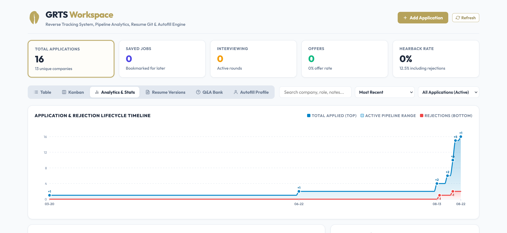

# GRTS (Gabe's Reverse Tracking System)

You have what it takes. You have the grit.

GRTS is a job application tracker at it's core. It auto-captures details of applications filled out and logs them in a database for review, accompanied by a wonderful dashboard which can be launched from the dropdown. This helps replace those manual Excel file entries. As a WIP feature, it also has an autofill engine. I recommend turning it off for normal browser use, but it does a decent job filling in apps (targeted at Workday) _fast_.

This keeps you wonderfully informed about what worked and what didn't. You can stop forgetting what you applied to or what the job description was. As you progress, adding marker details is easy. All your numbers in one beautiful display.


---

## Architecture

The project has three main parts:

- [`backend/`](./backend/README.md) – FastAPI and SQLite service running on `http://127.0.0.1:8000`. Handles storage, timeline milestones, title/location normalization, and analytics.
- [`extension/`](./extension/README.md) – Manifest V3 browser extension (Firefox & Chromium) with content parsers, autofill engine, and a standalone single-page dashboard.
- [`scout/`](./tests/README.md) - This is a coming proposal for universal job search that would aid in avoiding repetition. Never see a job you applied to already, scout only tells you what is fresh. _NOT WORKING_

---

## 

## Quickstart

### 1. Start the Backend

```bash
make install
make start-bg
```

Backend runs at `http://127.0.0.1:8000`. API docs available at `http://127.0.0.1:8000/docs`.

### 2. Load the Extension

**Firefox:**

1. Open `about:debugging#/runtime/this-firefox`
2. Click **Load Temporary Add-on...**
3. Select `extension/manifest.json`

**Chrome / Brave / Edge:**

1. Open `chrome://extensions/` and enable **Developer mode**
2. Click **Load unpacked** and select the `extension/` folder

### 3. Open the Dashboard

<h1 style="color: red">Important</h1>

Click the extension popup and hit **Open DB**, or open `extension/dashboard.html` in your browser.

### Local Data and Public Checkouts

The application database, extension profile cache, resume files, scout feed, scraped ATS pages, and generated artifacts are local-only and ignored by Git. They are intentionally not part of a public checkout. Enter your own profile in the dashboard after starting the backend; existing local databases and fixtures remain on disk when you update this repository.

---

## Common Commands

```bash
make install          # Install Python dependencies
make start-bg         # Start backend silently in background (no terminal window)
make stop             # Stop background backend service
make status           # Check if backend is running on port 8000
make autostart-on     # Enable auto-start on login (Windows Startup / macOS LaunchAgent)
make autostart-off    # Disable auto-start on login
make desktop-shortcut # Create 1-click launcher on Desktop (.vbs on Windows / .command on macOS)
make backup           # Create safe DB snapshot (.db) and SQL dump (.sql)
make restore          # Restore DB from available backups
make test             # Run unit test suite
make clean            # Clean Python cache files
```

### 1-Click Launchers (No Terminal Needed)

- **Windows**: Double-click `launch_dashboard.vbs` or `start_grts.vbs`
- **macOS**: Double-click `launch_dashboard.command` or `start_grts.command`

## Notes from the Dev

There is a lot left to do for this tool, but I think it is in a good enough place to be useful to tons of people. Future work will include

- figuring out a way to make launching more user friendly and avoid the terminal all together (currently needed to launch the DB).
- Getting Scout working, completely untested.
- Ever improving the autofill through constant testing

As a disclaimer, lots of AI was used in making this project. I've worked solo and the scale is not feasible for a full-time student or employee alone. That said, if you have cool ideas and want to work together, let me know!
